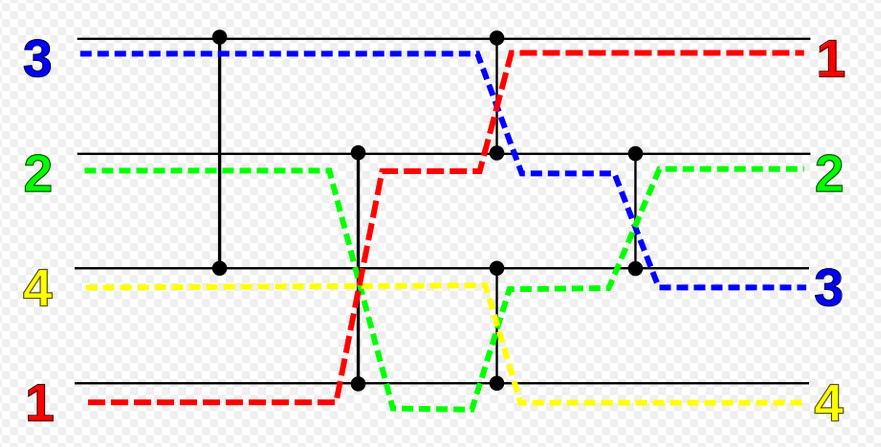

# Rapport sur le projet du réseau de tri
# C++/QT
### Barron Jean-Pascal M1 RIS Ynov Campus Bordeaux

https://github.com/ed0dy/Reseau_de_tri_graphique_QT

## Le réseau de tri



Le but est de trier les nombres par ordre croissant.

## Le code :

Cette fonction sert à dessiner toutes les lignes et les points noir pour schématiser le réseau de tri.

```c++
void MaFenetre::paintEvent(QPaintEvent *)
{

}
```

Cette fonction s'éxécute lors de l'appuie sur le bouton "Trier".

```c++
void MaFenetre::on_pb_Stocker_released()
{

}
```
On récupère ensuite les chiffres rentrés par l'utilisateur.

```c++
//Récupération des chiffres entrés par l'utilisateur
    chiffre1 = ui->chiffre1->value();
    chiffre2 = ui->chiffre2->value();
    chiffre3 = ui->chiffre3->value();
    chiffre4 = ui->chiffre4->value();
```
On effectue ensuite le tri de ces chiffres avec des conditions. Chaque conditions représente une connexion entre chaque "fils"

Un exemple de comparaison entre deux fils (connecteur) : 

```c++
//Connecteur 1
    if (chiffre1 > chiffre3)
    {
        stock = chiffre3;
        chiffre3 = chiffre1;
        chiffre1 = stock;
    }
```
Enfin on affiche les chiffres triés dans les "lcdNumber"

```c++
//Affichage des chiffres triés
    ui->lcdNumber->display(chiffre1);
    ui->lcdNumber2->display(chiffre2);
    ui->lcdNumber3->display(chiffre3);
    ui->lcdNumber4->display(chiffre4);
```
## Le résultat final :

